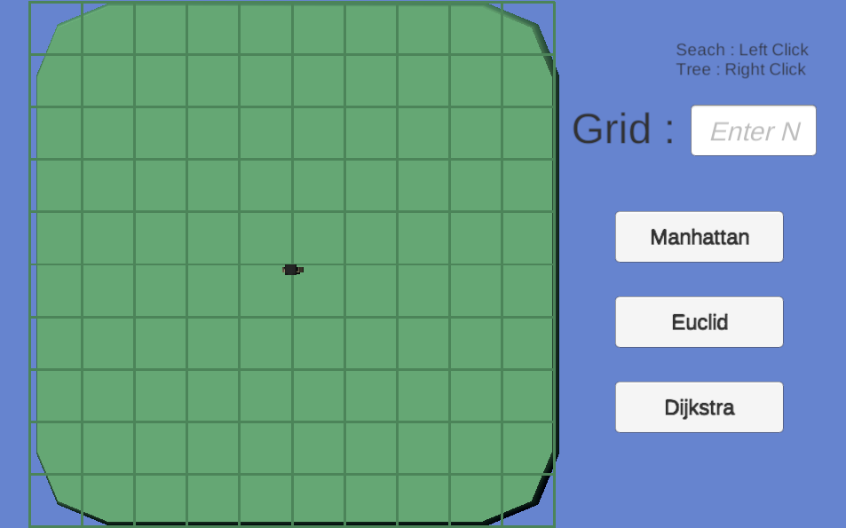

# A* Algorithm
This is a sample A* Algorithm Project. 
[Playable Web Version](https://taeahnk.github.io/AStarAlgorithm/)  
[BlogLink](https://code-in-coffee.tistory.com/44)

</img>

## Heuristics
A* Algorithm uses Heuristic Functions to calculate shortest path.  
This project uses 3 different logics

### Manhattan Distance
$|px-qx| + |py - qy|$

### Euclidean Distance
$\sqrt{(px - qx)^2 + (py - qy)^2}$

### Dijkstra 
No Heuristics ($h(x) = 0$)

## How to 
1. Set Grid Size by entering N
2. Set Obstacles with Right Clicks
3. Search path with Left Click

**Warning : 15+ N is heavy**
